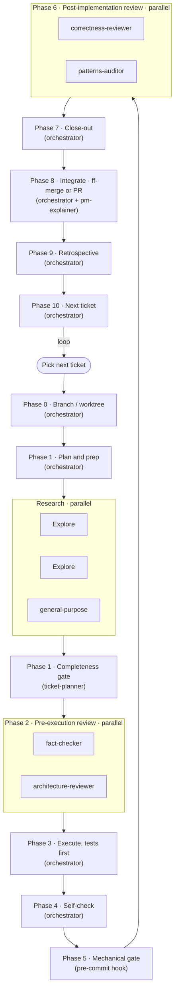

# Greenfield

Build and customize a production-ready agentic workflow with a single skill.

Greenfield doesn't ship you a set of out-of-the-box agents and skills. Run `/greenfield`, explain your project, and it will research best practices, nail down your architecture, set up testing and quality guardrails, and create a repeatable, ticket-based workflow you can use to carry your project from initialization to launch and beyond.

Point it at an empty directory to scaffold a new project (**init**), or at an existing repo to review it against the harness and install only what's missing (**audit**).

Greenfield is intended for serious engineering that scales as your project goes from MVP to thousands of lines. It's built on a foundation of locking things in from the beginning: scale—decision-complete tickets, a fast deterministic gate, executable architecture, independent review, externalized memory, and so on. Each factor gets a concrete artifact ready for agentic use, and the skill will help you make lasting architecture decisions up front.

Once it's in place, your workflow is one command.

## Installation

Add the marketplace, then install the plugin:

```
/plugin marketplace add davidegreenwald/deg-marketplace
/plugin install greenfield@deg
```

Reload so Claude registers the skill:

```
/reload-plugins
```

## Requirements

Claude Code with plugin support. The `displayName` field in the manifest uses a feature added in Claude Code 2.1.143, so older versions show the plugin under its raw name instead — the skill itself works regardless.

## What it does

- **Decision-complete tickets** — every decision resolved before code is written, no "TBD".
- **A fast hook-enforced quality gate** — one `verify` command (lint + types + tests + architecture) is the Definition of Done, run at commit time.
- **Independent reviewer subagents** — read-only reviewers with distinct lenses return structured verdicts before merge.
- **ADRs** — decisions recorded with their alternatives and the *why*.
- **Path-scoped rules** — layered CLAUDE.md plus `.claude/rules/*` deliver the right constraint where it applies.
- **A `/work` command** — ties tickets, the gate, reviewers, and a retrospective together.

For an unfamiliar project shape, it first fans out a round of research on the stack's idiomatic structure, reference architectures, and tooling, then drives the interview from primary sources. Technical choices are presented as staff-engineer recommendations — the suggested option is marked `(recommended)` with a one-line why and its source, and the architecture decision names the style and cites the sources that will constrain the project, so you can accept it or counter.

## How to use it

Greenfield is user-invoked. Run it directly:

```
/greenfield:greenfield [optional: project path]
```

It opens with a short summary, asks **init** or **audit**, then runs the interview. Running it with no argument is fine.

- **Init** — empty repo → full scaffold. Creates the tree from the checklist, initializes git, seeds an empty work-items registry, writes the architecture and quality-gate ADRs, installs hooks, and proves the `verify` gate green on the scaffold.
- **Audit** — existing repo → review first. Scores what's present against the 13 factors, reports the gaps, and (with your go-ahead) adds only what's missing. It never clobbers what's there, reuses existing gates and config, and migrates inline decisions into ADRs and backlog notes into tickets.

## Working on your project

After Greenfield's work is done, you'll drive your project with Claude Code from the `/work` skill, which will trigger the workflow you've just created to plan and execute the next ticket. When that work is done, you'll be pointed to the next one.

There's no further need for Greenfield after the initial set-up or audit. You can work with Claude directly in your project to make changes as your project grows—add a "staff engineer" sub-agent for architecture help, drop a workflow step you don't need, or research the next round of tickets. Claude will have all of the context it needs.

### The `/work` pipeline

Here's an example /work pipeline Greenfield can generate—trim, re-order, or add to fit your project.



## What's inside

The skill ships the principles plus the formats it needs to realize them, so it depends on no other skill:

- `SKILL.md` — the principles-first core: the 13 factors and the five-step process.
- `supplements/success-factors.md` — the 13 factors in depth (mechanism, failure mode, per-stack form).
- `supplements/checklist.md` — the audit rubric that drives both modes.
- `supplements/interview.md` — the research-driven question script with recommended picks.
- `supplements/ecosystem-profiles.md` — gate / architecture / test / hook tooling per stack (Python, Node/TS, Swift, Rust, Go, and a generic fallback).
- `supplements/exemplars/` — "adapt, do not copy" reference realizations: ticket template, work-items registry, the `/work` skill, ADR template, agent roster, rules, and hooks.

## Versioning

The plugin follows semantic versioning, pinned in both `plugin.json` and the marketplace entry. Bump the version on a release so installs pick up the change; see `CHANGELOG.md` for history.

## License

MIT. See `LICENSE`.
