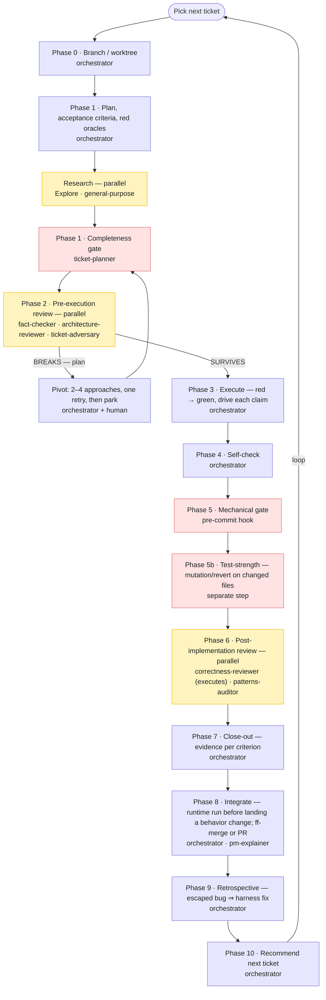

# Greenfield

Build and customize a production-ready agentic workflow with a single skill.

Greenfield doesn't ship you a set of out-of-the-box agents and skills. Run `/greenfield`, explain your project, and it will research best practices, nail down your architecture, set up testing and quality guardrails, and create a repeatable, ticket-based workflow you can use to carry your project from initialization to launch and beyond.

Point it at an empty directory to scaffold a new project (**init**), or at an existing repo to review it against the harness and install only what's missing (**audit**).

Greenfield is intended for serious engineering that scales as your project goes from MVP to thousands of lines. It locks things in from the beginning: decision-complete tickets, a fast deterministic gate, executable architecture, independent review that runs the code, externalized memory, and — new in V2 — a definition of done an agent cannot talk its way past. Each factor gets a concrete artifact ready for agentic use, and the skill helps you make lasting architecture decisions up front.

Once it's in place, your workflow is one command.

## Installation

Add the marketplace, then install the plugin:

```
/plugin marketplace add davidegreenwald/deg-marketplace
/plugin install greenfield@deg
```

Reload so Claude registers the skill:

```
/reload-plugins
```

## Requirements

- **Claude Code** with plugin support. The `displayName` field in the manifest uses a feature added in Claude Code 2.1.143; older versions show the plugin under its raw name — the skill itself works regardless.
- **An Opus-class model or higher** (Claude Opus 4.x/5, or Fable) for the `/greenfield` run itself. Greenfield researches your stack from primary sources, runs a multi-batch interview, and generates a dozen interdependent artifacts that must agree with each other — long-horizon orchestration that smaller tiers handle unreliably. The `/work` pipeline it generates assigns cheaper models to mechanical checks on its own; this requirement is for the scaffolding run.

## What it does

- **Decision-complete tickets** — every decision resolved before code is written, no "TBD".
- **Success criteria bound to red oracles** — every ticket carries numbered acceptance criteria, each bound to a named test or runtime step that was seen failing before the work began. A criterion with no oracle, or one already green, stops the ticket.
- **A fast hook-enforced quality gate** — one `verify` command (lint + types + tests + architecture) runs at commit time.
- **A definition of done** — a ticket closes on evidence (a rerunnable command and its actual output per criterion, a green gate, recorded reviewer verdicts), never on the agent's say-so. A broken design gets one retry, then the ticket parks instead of looping.
- **A definition of a bug** — a defect enters as a typed `Bug` ticket with its named consequence, a reproduction, and a red regression test before any fix is written.
- **Runtime proof** — a behavioral claim is proven by driving the real system, never by citing code. Projects get an evidence rule and a runtime-harness exemplar (with proofs that the harness can fail and is deterministic), and the `/work` pipeline runs the harness before landing a behavior change. If you can't run the real thing, you're theorizing.
- **Independent adversarial review that executes** — read-only reviewers with distinct lenses, one that tries to break the ticket before it's built and one that runs the tests on the diff, return structured verdicts before merge. Consensus is not verification; execution is.
- **Test-strength** — a mutation or revert check, kept out of the fast gate, proves the suite can go red.
- **ADRs** — decisions recorded with their alternatives and the *why*, including an ADR that pins what "done" means per dimension.
- **Path-scoped rules and context scoping** — layered CLAUDE.md plus `.claude/rules/*` deliver each constraint only to the agents that need it; an audit checks nothing orchestrator-only bloats every subagent.
- **A performance measure where it applies** — a repeatable benchmark with a threshold that fails the build on regression, or a justified N/A.
- **A `/work` command** — ties tickets, the gate, reviewers, and a retrospective together.

For an unfamiliar project shape, it first fans out a round of research on the stack's idiomatic structure, reference architectures, and tooling, then drives the interview from primary sources. Technical choices are presented as staff-engineer recommendations — the suggested option is marked `(recommended)` with a one-line why and its source, and the architecture decision names the style and cites the sources that will constrain the project, so you can accept it or counter.

## How to use it

Greenfield is user-invoked. Run it directly:

```
/greenfield:greenfield [optional: project path]
```

It opens with a short summary, asks **init** or **audit**, then runs the interview. Running it with no argument is fine.

- **Init** — empty repo → full scaffold. Creates the tree from the checklist, initializes git, seeds an empty work-items registry, writes the architecture, quality-gate, and definition-of-done ADRs, installs hooks, and proves the `verify` gate green on the scaffold.
- **Audit** — existing repo → review first. Scores what's present against the 17 factors, reports the gaps, and (with your go-ahead) adds only what's missing. It never clobbers what's there, reuses existing gates and config, and migrates inline decisions into ADRs and backlog notes into tickets.

## Working on your project

After Greenfield's work is done, you'll drive your project with Claude Code from the `/work` skill, which will trigger the workflow you've just created to plan and execute the next ticket. When that work is done, you'll be pointed to the next one.

The runtime harness is built by `/work`, not by Greenfield: the first ticket whose claim is about the running system — "the sync writes nothing on a re-run", "the modal opens" — builds the harness as part of its scope, using the exemplar and the per-stack driver table Greenfield installed. Until then, the project records the deferral in its quality-gate ADR.

There's no further need for Greenfield after the initial set-up or audit. You can work with Claude directly in your project to make changes as your project grows — add a "staff engineer" sub-agent for architecture help, drop a workflow step you don't need, or research the next round of tickets. Claude will have all of the context it needs.

### The `/work` pipeline

Here's an example /work pipeline Greenfield can generate — trim, re-order, or add to fit your project.



At the end of each roadmap phase — not each ticket — the pipeline also seeds a phase-exit audit ticket: reviewers fan out over the whole tree, every finding is adversarially verified, and the next phase's tickets come out of it.

## What's inside

The skill ships the principles plus the formats it needs to realize them, so it depends on no other skill:

- `SKILL.md` — the principles-first core: the 17 factors and the five-step process.
- `supplements/success-factors.md` — the 17 factors in depth (mechanism, failure mode, per-stack form).
- `supplements/continuation.md` — the debugging-cycle discipline: provable outcome, red-before-green, review that executes, runtime proof, the adversary, test-strength, the definition of a bug.
- `supplements/checklist.md` — the audit rubric that drives both modes, including the context-scoping sub-audit.
- `supplements/interview.md` — the research-driven question script with recommended picks.
- `supplements/ecosystem-profiles.md` — gate / architecture / test / mutation / performance / runtime-driver tooling per stack (Python, Node/TS, Swift, Rust, Go, and a generic fallback).
- `supplements/exemplars/` — "adapt, do not copy" reference realizations: ticket template (with the Bug variant and acceptance criteria), work-items registry, the `/work` skill, ADR template, agent roster (including the adversary and the executing reviewer), rules (including the evidence rule), hooks, the runtime harness, the review-finding bar, the phase-exit audit ticket, and instruction placement.

## Versioning

The plugin follows semantic versioning, pinned in both `plugin.json` and the marketplace entry. Bump the version on a release so installs pick up the change; see `CHANGELOG.md` for history.

## License

MIT. See `LICENSE`.
